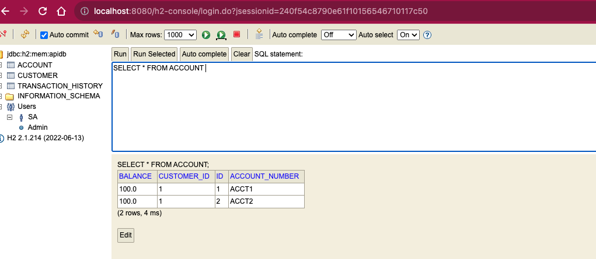
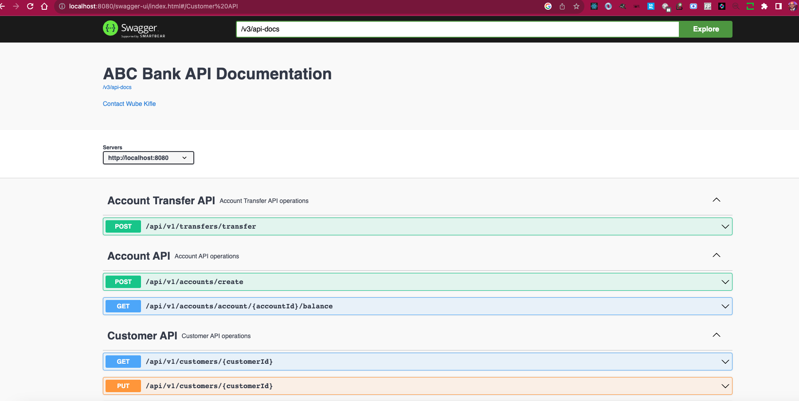

# ABC Bank API

Internal API for Bank of ABC to manage accounts and transactions.

## Getting Started

These instructions will help you to run the application on your local machine for development and testing purposes. 

### Prerequisites

Requirements for the software and other tools to build, test and push
- JAVA 17
- Spring Boot 3.1.4
- Gradle 7.2

### Database
- H2 in memory Database Engine


### Building and Running the application locally


### Clone the repository

```
git clone https://github.com/wube-anomeg/bank-api.git
```


The app uses JAVA version 17. Make sure you have java 17 installed and set as your default java version 17.
Use this link to install java 17 on your machine [https://www.oracle.com/java/technologies/downloads/#java17](https://www.oracle.com/java/technologies/downloads/#java17).
Check your Java version by running the following command

```
java --version
```

### You can also import the project into your favorite IDE and run it from there.

### Or you can run the app from your local terminal using the following steps below:

Note. The CUSTOMER and ACCOUNTS tables are prepopulated in the database with some sample data at startup.

You can check the data in the database by navigating to [http://localhost:8080/h2-console](http://localhost:8080/h2-console) in your browser.

Be sure that the JDBC URL: is set to **jdbc:h2:mem:apidb**.

Use the following credentials to login to the H2 in mem database.

```
username: sa
password: password
```

Note. The database is in memory and will be destroyed when the application is stopped.




The database has 3 tables TRANSACTION_HISTORY, CUSTOMER and ACCOUNTS.

Please refer the domain model for the details of the tables and the relationships.

### Packaging as jar and run the application locally

To build the final jar and optimize the API application, run:

```
Navigate to the the project root directory where you cloned the application 
```

Run this command to build the jar file
```
./gradlew -Pprod clean bootJar
```


Run this command to run the jar file

```
java -jar build/libs/*.jar
```

Then navigate to [http://localhost:8080/actuator/health](http://localhost:8080/actuator/health) in your browser.
You should see the following response
```
{
    "status": "UP"
}
```

## Testing the API via Swagger UI

Navigate to [http://localhost:8080/swagger-ui/index.html](http://localhost:8080/swagger-ui/index.html) in your browser.



You can test all the API endpoints from the swagger UI.

API to test the POST transfer api to transfer money from one account to another.
```
POST api/v1/transfers/transfer
```
```
{
  "sourceAccountId": 1,
  "targetAccountId": 2,
  "amount": 50
}
```
You should see the following response
```
The amount of $ 50.0 successfully transferred
```

## Running the unit tests

``` 
./gradlew test 

```

### Running the Integration tests

```
 ./gradlew integrationTest 

```

### Running both unit test and  Integration tests

```
 ./gradlew test integrationTest 

```

## Versioning

We use [Semantic Versioning](http://semver.org/) for versioning.

## Authors

- **Wube Kifle** 


 